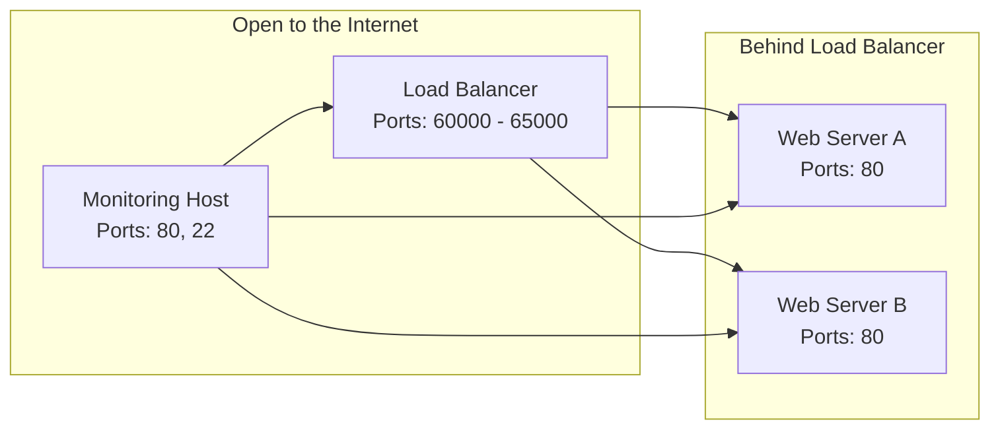
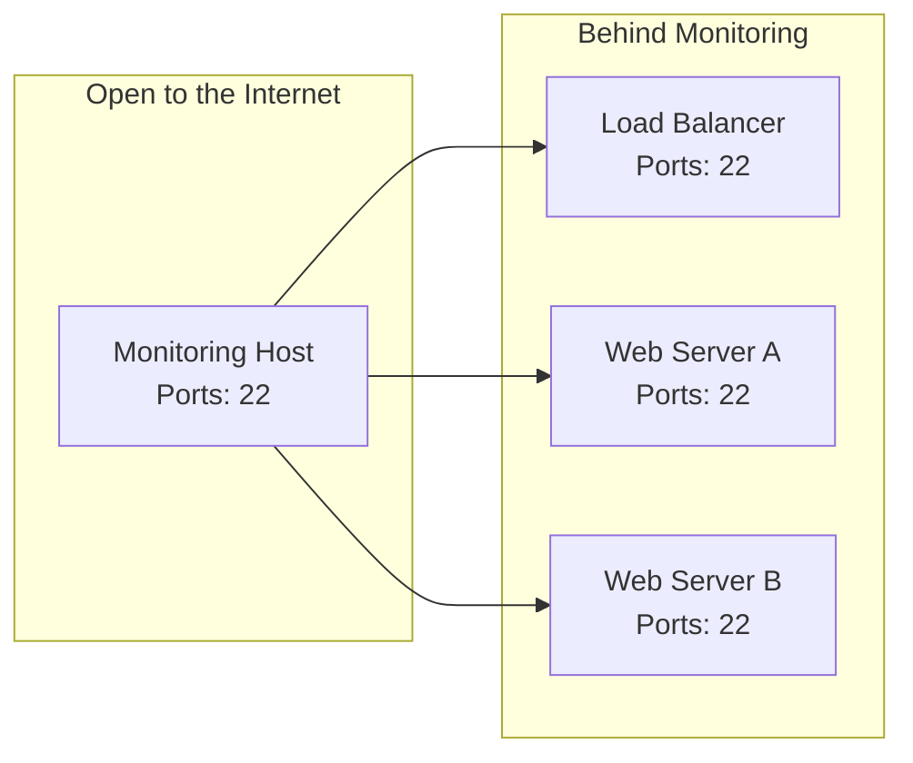

# mini-env-project

Contains the code used while establishing the mini environment challenge.

## Design Decisions

- I ultimately chose to use ansible to configure the hosts.
  - Repeatability wasn’t in the requirements, and this was a small task. In the beginning leaned toward **not** using Ansible because it didn’t seem worth the additional time based on requirements.
  - After working on this for a bit I decided it would be good to show that I could use the tool, and I got tired of reapplying some changes during manual testing, so I used Ansible after all. It also supports Jinja templating out of the box, making it easy to create and apply the `index.html` and HAProxy config file(s). I didn’t go back and rewrite the bash script I originally started with for setting up the users. Some tech debt was created here but could be easily migrated over.
  - I rewrote the initial scripts to be an ansible playbook so we have can have on playbook to launch the entire environment.
  - The initial structure of the repo doesn't follow the Ansible recommended conventions very strictly because:
    - I thought it introduced a lot of overhead for this simple task.
    - In an email exchange "simplicity and clarity" were mentioned as objectives and while I can see both sides of the argument (following the convention makes it simpler versus not) I ultimately decided what I originally implemented was pretty easy to digest.
    - Depending on how often you use ansible it can make it more challenging to debug and read following the convention strictly.
    - I have another branch pushed that refractors the repo to more tightly align with the recommended Anssible conventions if that would be preferred. Normally I would either look at examples of how it has been previously done/implemented or ask for guidance.
- I used Apache for the web servers: extremely popular, free, available via `apt`, and already used for Nagios.
  - Popularity usually means great community supporting documentation.
- I chose HAProxy as the load balancer; it is extremely popular, lightweight, and readily available via `apt`.
  - I chose to use source for the balancing scheme because I interpreted the requirements given in the email to mean host as an IP, not a browser.
    - This could be easily switched to use cookie-based stickiness.
  - I did not port forward port 80 on the load balancer; requirements only specified port range 60000–65000.
    - I also kept that port range open to the internet.
  - I used the monitoring host as the bastion/jump host because it wouldn’t normally be public-facing and has a small load to handle.

### Web Traffic Network Diagram



### Admin Network Diagram



## Setup Users

1. I created two helper scripts to automate some of the actions: `copyFiles.sh` and `userSetup.sh`.
2. I created an SSH key for the `ubuntu` user on the load balancer node.
3. I distributed the newly created key to the remaining hosts, allowing SSH access from the load balancer.

- `copyFiles.sh`: Copies the public key file and the `userSetup.sh` script to the remote hosts listed in the `hosts` file and runs the `userSetup.sh` script on the remote host.

  **Usage:** `<ssh_user> <hosts_file> <path_to_public_key>`

- `userSetup.sh`: Creates the `expensify` user, adds sudo, and sets the `authorized_keys` file.

- `hosts`: Text file containing a list of IPs separated by newlines.

## Update Base OS

It is generally considered good practice to keep packages up to date, as you are usually patching CVEs with the updates.

```bash
ansible-playbook -i hosts.ini upgrade-system.yml
```

## Enable Passwordless Sudo

I enabled passwordless sudo for the `expensify` user.

```bash
ansible-playbook -i hosts.ini passwordless-sudo.yml
```

## Install Nagios

1. I installed Nagios on 34.220.36.87.
    - I used documentation from [Nagios](https://support.nagios.com/kb/article/nagios-core-installing-nagios-core-from-source-96.html#Ubuntu) to generate an Ansible playbook.
    - User created: `nagiosadmin:nagiosadmin`
    - Access via <http://34.220.36.87/nagios>
2. I added the remaining hosts to be monitored by Nagios.
3. I removed the localhost check for swap memory because it was a false alarm.

```bash
ansible-playbook -i hosts.ini nagios-setup/install-nagios.yml
ansible-playbook -i hosts.ini nagios-setup/add-hosts-to-nagios.yml
```

### Create Custom Nagios Check

1. I created a Python script that pings X number of hosts based on a configuration file.
2. I created an Ansible playbook to install the script and config file on the backend host.
3. I tested the plugin by disabling ICMP requests using iptables:
   - `sudo iptables -I INPUT -p icmp --icmp-type echo-request -j DROP`
   - I disabled it on web server A and validated `WARNING`.
   - I disabled it on web server B and validated `CRITICAL`.
4. I created a playbook to disable ICMP requests to more easily automate testing the script.

```bash
ansible-playbook -i hosts.ini nagios-setup/add-custom-nagios-check.yml
ansible-playbook -i hosts.ini tests/nagios-custom-script-check.yml
```

## Setup Internal Access from Monitoring Host

1. I generated an SSH key pair for the `ubuntu` user on the monitoring host.
2. I added the public key to the `authorized_keys` file on the remaining hosts.
3. I verified SSH access from the monitoring host to the web servers and load balancer.

```bash
ansible-playbook -i hosts.ini generate-push-ssh-key.yml
```

## Setup Web Servers

- Web server A: 34.210.75.57  
- Web server B: 34.220.22.168

1. I installed Apache:

   ```bash
   apt install apache2
   ```

   - I tested that Apache was working.
2. I updated the `index.html` on server A or B depending on host IP.
   - I tested each server individually to verify:
     - <http://34.210.75.57> returns `A`
     - <http://34.220.22.168> returns `B`

```bash
ansible-playbook -i hosts.ini webservers/setup-webserver.yml
```

## Setup Load Balancer

1. I installed HAProxy on the host.
2. I updated the HAProxy config to meet the following requirements:
    - 3.2. Load balancer must distribute traffic between Web Server A and Web Server B.
    - 3.3. Implement session stickiness based on client IP address.
    - 3.4. Session stickiness must persist unless the original server goes down.
    - 3.5. Do **not** revert to the original server once it recovers.
    - 3.6. Forward the original client IP address to backend servers.
    - 3.7. Forward all ports in the range `60000–65000` to backend servers' port `80`.

```bash
ansible-playbook -i hosts.ini haproxy-setup/install-haproxy.yml
```

## Lockdown Network

As someone who has locked himself out of remote boxes before (who hasn’t!?), I was very careful with this step. I had multiple terminals already shelled into the hosts and set up the playbook to run one set of servers at a time so I could verify the changes before fully committing.

1. I created a playbook to install `ufw` and set up the following rules to meet the requirements:
   - 6.1 and 6.3. Deny all traffic on all hosts.
   - 6.1. Allow SSH from anywhere on the monitoring host (34.220.36.87).
   - 6.2. Allow SSH only from the monitoring host on all other hosts.
   - 6.3. Allow ports 60000–65000 on the load balancer.
   - 6.3. Allow port 80 on the web servers only from the load balancer.

```bash
ansible-playbook -i hosts.ini network-lockdown.yml
```

## Setup Complete Environment

Running the playbook below will run the rest of the playbooks in the correct order to stand up the entire challenge.

```bash
ansible-playbook -i hosts.ini environment-stand-up.yml
```

## Notes

- You asked for detailed notes of my process, generally whenever I start something it starts with notes on paper. I included the notes I scribbled down on paper in the repo.
- I updated `authorized_keys` for `ubuntu` to use a different computer. The original SSH key was on my desktop.
- In the email, the Ubuntu version referenced was 20.04; the actual version was 24.x.
- I chose the load balancer host based on the IP address. The 54.x.x.x address is on a completely different network than the other three hosts. The other three hosts were randomly assigned for the web servers and monitoring host.
- I added the monitoring Ubuntu SSH key under the `expensify` user on the load balancer for testing.
- I originally installed Nagios myself so the ansible playbook to install Nagios hasn't been tested other than with `ansible-playbook --check`. If I was working normally I would stand up another EC2 to test the playbook out on that way I wouldn't impact what was working.

## Challenges

- Nagios installation instructions gave errors when installing packages. I was using the instructions for Ubuntu 20.x.
  - I verified the host OS version using `lsb_release -a` and then used the correct instructions for the current OS 24.x.
- I couldn’t reach Nagios, so I thought something was wrong with the install — really, I just couldn’t read.
  - I verified that port 80 was open/listening with `netstat`.
  - I realized I was trying to access Nagios on the wrong host.
- I had an issue getting the load balancer to properly switch traffic after a failed host. I realized the config was wrong; I didn’t include the proper balancing method and a check for the backend servers' availability.
- The `nagios` binary wasn’t in the system `$PATH`. I had to track down where it was installed by looking at the command history on the host:
  - `/usr/local/nagios/bin/nagios`
  - I added this back into the Nagios playbook but manually implemented it on the host.
- When testing failover, it appeared the load balancer wasn’t using the stickiness setting when using curl (using a web browser, it worked fine). After poking around online, I found out why:
  - HAProxy uses a hash of the IP + port.
  - When you run a curl loop, the source port can be a bit random, leading you to appear as a "new" host.
  - This is a drawback of the decision to use host-based stickiness versus cookie- or session-based.
  - I tested using a cookie or session based sticky instead and this would work with curl assuming you passed it into the command correctly.

## References

- <https://support.nagios.com/kb/article/nagios-core-installing-nagios-core-from-source-96.html#Ubuntu>
- <https://upcloud.com/resources/tutorials/haproxy-load-balancer-ubuntu>
- ChatGPT to help generate and review code and files.
